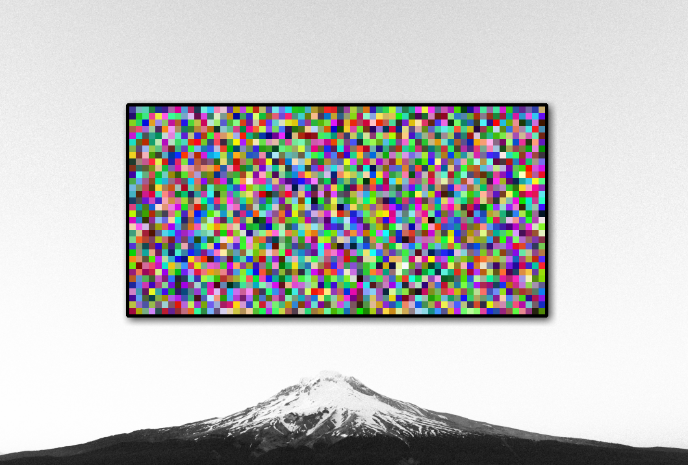

# V_Display

V_Display is an small API layer on top of SDL to create a virtual display for
emulators. This project is an attempt to take the display logic out of my
chip-8 project for reuse in other emulator projects.



## Getting started

```rust
use display::DisplayBuilder;
use rand::prelude::*;
use sdl2::event::Event;
use sdl2::keyboard::Keycode;

fn main() {
	//init display builder with diplay name, width and height in virtual pixels and virtual pixel size
	let mut display = DisplayBuilder::new("Display", 64, 32, 10)
	    .with_margin(5, 5)
	    .build()
	    .unwrap();
	let mut rng = rand::thread_rng();
	'main: loop {
	    for event in display.get_event_pump().poll_iter() {
		match event {
		    Event::KeyDown {
			keycode: Some(Keycode::Escape),
			..
		    } => {
			println!("escape received");
			break 'main;
		    }
		    _ => {}
		}
	    }
	    let buffer: Vec<(u8, u8, u8)> = (0..display.width() * display.height())
		.map(|_| {
		    (
			rng.next_u32() as u8,
			rng.next_u32() as u8,
			rng.next_u32() as u8,
		    )
		})
		.collect();

	    display.from_buffer(&buffer);
	    display.refresh();
	    std::thread::sleep(std::time::Duration::from_millis(20));
	}
}
```
